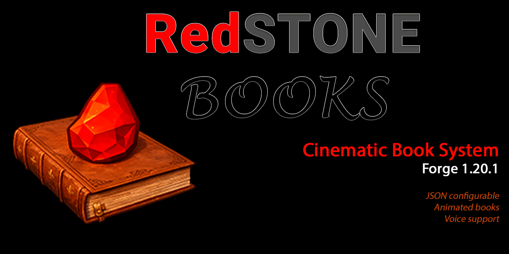
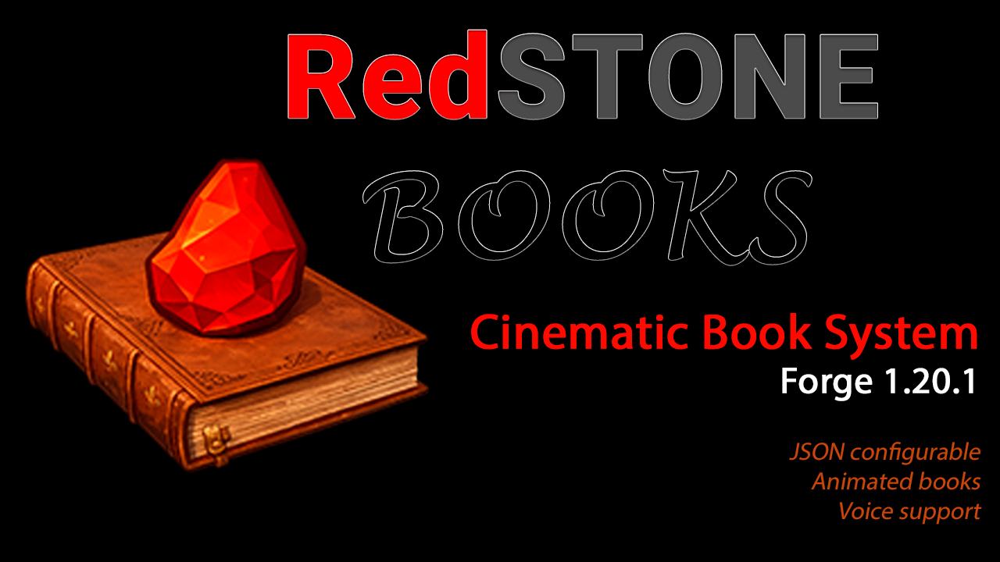

# Redstone Books
<p align="center">

</p>

Pensado para:
- Cinemáticas
- Misiones
- RPG / aventuras
- Datapacks
- Mapas personalizados
- Servidores
- Mods con historia



Sistema de libros cinematográficos configurable por JSON para Minecraft Forge 1.20.1  
Este mod permite mostrar libros animados en pantalla con texto, voz, animaciones, efectos de transición y configuración completa desde archivos JSON.

---

## Características

- Animación de apertura de libro por frames
- Animación inversa al cerrar
- Texto configurable por página
- Voz por página
- Efecto máquina de escribir
- Fade in / fade out configurable
- Layout configurable por libro
- Posición del texto configurable
- Colores configurables
- Escala configurable
- Indicador de página opcional
- Configuración por JSON
- Soporte para múltiples libros
- HUD oculto automático
- Bloqueo de input opcional

---

## Instalación

1. Instalar Forge 1.20.1  
2. Copiar el archivo `.jar` en:

.minecraft/mods/

o en servidor:

server/mods/

3. Iniciar el juego

---

## Uso básico

Comando:

/redstonebook open <id>

Ejemplo:
/redstonebook open guardian

El libro se carga desde:

config/redstonebooks/books/<id>.json

---

## 📁 Estructura del sistema (v1.1.0)

Cada libro es completamente independiente.

config/redstonebooks/books/<id>.json

assets/redstonebooks/
├── textures/books/<id>/
└── sounds/books/<id>/

---

## Ejemplo completo de JSON

```json
{
  "id": "guardian",

  "meta": {
    "title": "CRÓNICAS DEL GUARDIÁN"
  },

  "theme": {
    "folder": "guardian"
  },

  "animation": {
    "enabled": true,
    "folder": "anim",
    "frameCount": 143,
    "frameRate": 1
  },

  "assets": {
    "cover": "book_cover.png",
    "reading": "book_reading.png"
  },

  "options": {
    "hideHud": true,
    "lockInput": true,
    "autoAdvance": true,
    "pageTurnTicks": 8,
    "showPageIndicator": true
  },

  "style": {
    "textScale": 1.0,
    "align": "LEFT",
    "lineSpacing": 1,
    "textColor": "#1E1A16",
    "textShadow": false
  },

  "typewriter": {
    "enabled": true,
    "charsPerTick": 2,
    "startDelay": 10
  },

  "layout": {
    "mode": "book",
    "openBookWidth": 0.74,
    "openBookHeight": 0.74,
    "textStartX": 0.55,
    "textStartY": 0.14,
    "textWidth": 0.30,
    "textHeight": 0.60
  },

  "transition": {
    "useFadeBetweenAnimationAndReading": true,
    "fadeOutTicks": 18,
    "blackHoldTicks": 8,
    "fadeInTicks": 20
  },

  "pages": [
    {
      "durationTicks": 200,
      "text": "Texto de ejemplo",
      "voiceSound": "redstonebooks:books.guardian.guardian_p1",
      "voiceVolume": 1.0,
      "voicePitch": 1.0
    }
  ]
}
```

---

## 🎵 Sonido

Ejemplo de sounds.json:

```json
{
  "books.guardian.guardian_p1": {
    "sounds": [
      {
        "name": "books/guardian/guardian_p1",
        "stream": true
      }
    ]
  }
}
```

---

## 🧪 Testing

/playsound redstonebooks:books.guardian.guardian_p1 master @p

---

## Showcase



---

## LICENCIA

All Rights Reserved

---

## CHANGELOG

### v1.1.0
- Correcciones de animación
- Nueva estructura modular
- Audio funcional

### v1.0.0
- Versión inicial
