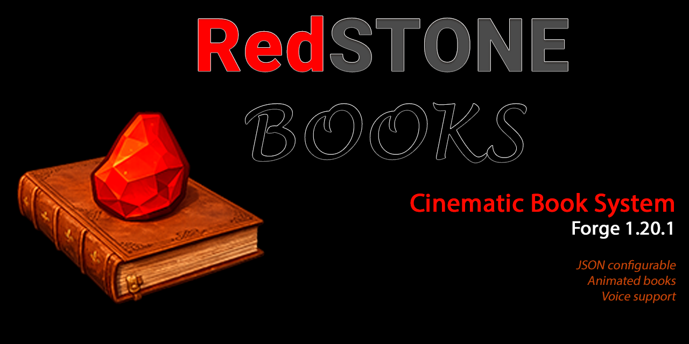
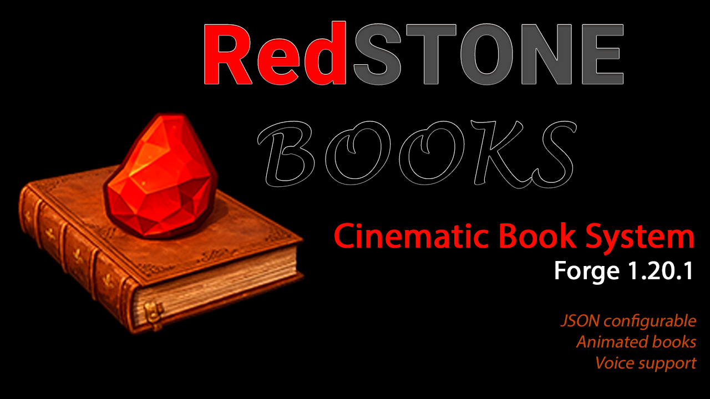

# 📖 Redstone Books

<p align="center">
  
</p>

<p align="center">
<b>A cinematic, JSON-driven book system for Minecraft Forge 1.20.1.</b>
</p>

## 🎬 Preview


<p align="center">
  
  
  
  
</p>

<p align="center">
🇬🇧 Cinematic book system for Minecraft<br>
🇪🇸 Sistema de libros cinematográficos para Minecraft
</p>

---



# ✨ Overview

Redstone Books is a lightweight Forge mod that allows creators to build fully cinematic books using JSON configuration.

Perfect for:

- 🎬 Cinematics
- 🧭 RPG adventures
- 🗺️ Custom maps
- 🌍 Multiplayer servers
- 📜 Story-driven mods
- 🧱 Datapacks

---

# 🚀 Features

- 📖 Frame-by-frame opening animation
- 🔊 Voice narration per page
- ✍️ Typewriter effect
- 🎨 Fully configurable layouts
- 🌫️ Fade transitions
- 📚 Multiple books support
- 🧠 JSON-driven configuration
- 🎮 HUD and input control
- 🌐 Dedicated server support
- 👥 Multiplayer synchronization

---

# 📦 Installation

Install Forge **1.20.1**

Client:

```text
.minecraft/mods/
```

Server:

```text
server/mods/
```

Launch Minecraft.

---

# 🎮 Commands

| Command | Description |
|---------|-------------|
| `/redstonebook open <book>` | Opens a book for yourself. |
| `/redstonebook open <book> <player>` | Opens a book for a specific player. |
| `/redstonebook open <book> @a` | Opens a book for all connected players. |

Example:

```text
/redstonebook open guardian
```

---

# 📁 Book Structure

Book definitions are stored on the **server**:

```text
config/redstonebooks/books/<id>.json
```

Resources (textures, animations and audio) are provided by the client resource pack:

```text
assets/redstonebooks/
├── textures/books/<id>/
└── sounds/books/<id>/
```

---

# 🌐 Multiplayer Architecture

- 📚 Books are loaded from the server.
- 📡 The server synchronizes book data to clients.
- 🖼️ Images, animations and audio are loaded locally from the resource pack.
- ✅ Ensures every player always receives the latest version of every book.

---

## 🧪 Ejemplo de JSON

```json
{
  "id": "guardian",
  "meta": {
    "title": "CRÓNICAS DEL GUARDIÁN"
  },
  "theme": {
    "folder": "guardian"
  },
  "animation": {
    "enabled": true,
    "folder": "anim",
    "frameCount": 143,
    "frameRate": 1
  },
  "assets": {
    "cover": "book_cover.png",
    "reading": "book_reading.png"
  },
  "options": {
    "hideHud": true,
    "lockInput": true,
    "autoAdvance": true,
    "pageTurnTicks": 8,
    "showPageIndicator": true
  },
  "style": {
    "textScale": 1.0,
    "align": "LEFT",
    "lineSpacing": 1,
    "textColor": "#1E1A16",
    "textShadow": false
  },
  "typewriter": {
    "enabled": true,
    "charsPerTick": 2,
    "startDelay": 10
  },
  "layout": {
    "mode": "book",
    "openBookWidth": 0.74,
    "openBookHeight": 0.74,
    "textStartX": 0.55,
    "textStartY": 0.14,
    "textWidth": 0.30,
    "textHeight": 0.60
  },
  "transition": {
    "useFadeBetweenAnimationAndReading": true,
    "fadeOutTicks": 18,
    "blackHoldTicks": 8,
    "fadeInTicks": 20
  },
  "pages": [
    {
      "durationTicks": 200,
      "text": "Texto de ejemplo",
      "voiceSound": "redstonebooks:books.guardian.guardian_p1",
      "voiceVolume": 1.0,
      "voicePitch": 1.0
    }
  ]
}
```

---

## 🎵 Sonido

Ejemplo de `sounds.json`:

```json
{
  "books.guardian.guardian_p1": {
    "sounds": [
      {
        "name": "books/guardian/guardian_p1",
        "stream": true
      }
    ]
  }
}
```

---

# 🧪 Testing

```text
/playsound redstonebooks:books.guardian.guardian_p1 master @p
```

---

# 📸 Showcase



---

# ⚖️ License

All Rights Reserved

---

# 📜 Changelog

## 🆕 v1.2.0

- 🌐 Dedicated server support.
- 📡 Network synchronization between server and clients.
- 📚 Books are loaded directly from the server.
- 👥 Support for opening books for specific players or all connected players.
- 🛠 Fixed dedicated server crash caused by client-only classes.

## 🆕 v1.1.0

- 🎞 Fixed animation issues (pink/black textures).
- 📖 New modular book structure.
- 🔊 Fully functional audio system.

## 🚀 v1.0.0

- 📚 Base cinematic book system.
- ⚙ JSON configuration.
- 📄 Multi-page support.
- ✨ Text rendering and visual effects.
- 🔊 Initial audio system.
